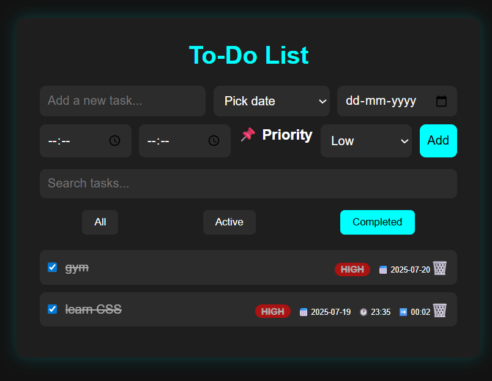

# 📝 Dark Themed To-Do List

A sleek and modern **To-Do List** web app with a **dark mode interface**, built using **HTML**, **CSS**, and **JavaScript**. This app allows you to create, prioritize, schedule, and manage tasks with custom dates, start & end times, and priority labels.

## ✨ Features

- 🌑 Dark theme for modern UI
- ➕ Add tasks with:
  - Custom date (calendar picker)
  - Start time and end time (24-hour format)
  - Priority levels: Low, Medium, High
- 📆 Quick date shortcuts: Today, Tomorrow
- 🔍 Search tasks by keyword
- ✅ Mark tasks as completed
- 📂 Filter: All, Active (today), Completed
- 💾 Saves your tasks in **local storage**

## 📸 Output Screenshot

